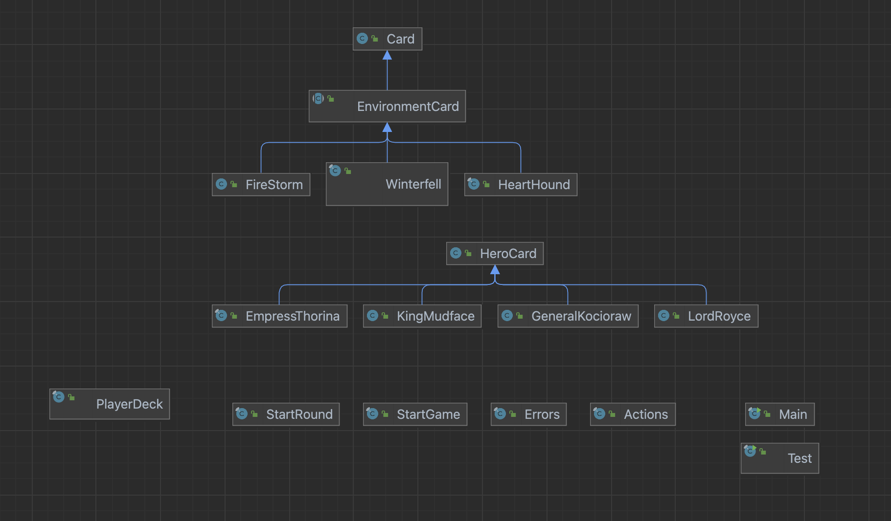

# GwentStone
### Copyright : Dobrica Nicoleta-Adriana 321CA

## Description:

* This game consists of two players, each of them having a deck of cards at the beginning of the game, and a special card called a Hero Card. They both have two rows assigned on a table for their cards. A typical game consists of certain commands: using the card's special abilities (that directly affect the opponent's cards or their own cards), attacking the cards etc.
* The game also implements debugging commands, offering useful information about the current game at any given time.
* The game table is the place where the cards can interact between each other: attack, use ability etc.

## Implementation

### UML Diagram:

### StartRound class:
* It's part of the "Start" package, which implements the starting point of the game - the round itself, which initializes the players, their respective information and the game table.
* A round is needed to keep up with certain information about the current game between the players: updating the number of wins, turns, the player's mana etc.

### StartGame class:
* Also part of the "Start" package, it's where the actual implementation of the game takes place. 
* This parses through the input and executes the commands from the game and the debugging commands.
* When a given command is parsed from the output, this class executes it (with the help of the Actions class) and outputs the results in a JSON file.

### Actions class:
* Part of the "Start" package, it implements almost all the possible actions that a player can do in the game, or the debugging commands. 
* Used a Singleton design pattern to have only one possible instance of this class.
* To implement the debugging commands I used fields/methods from the StartRound class; these commands print a player's mana, whose turn it is, the cards from the game table etc.
* The methods implemented in this class revolve around the possible actions a card can have in a turn: using its ability to affect a card (for Minion cards), attacking another card or affecting an entire row (for Environment cards)

### Errors class:
* Part of the "Start" package, implements all the possible errors that can be encountered during a game, checking whether a player's cards or actions may or may not be valid
* Used a Singleton design pattern for this class

### Card class:
* Part of the "Decks" package, represents the "parent" of the hierarchy of cards created
* Aside from the main fields needed for the card, there are other fields created for ease of use: flags to know whether a card has been marked as 'frozen' or if that card has already attacked or used its abilities.
* It is similar to an interface for the other types of cards: it provides the main functionalities that every card should have.

### HeroCard class:
* Part of the "Decks" package, it represents a special type of card that each player has.
* Similar to the Card class, it acts as an interface for the other types of HeroCards.
* These cards are special because not only they have a fixed health value of 30 and special abilities, but if they die, the game ends.

### LordRoyce class:
* Part of the "Decks" package, it extends the HeroCard class
* Implements Lord Royce's special ability: freezing a card with the biggest attack damage from the opponent's cards in hand

### EmpressThorina class:
* Part of the "Decks" package and extends the HeroCard class
* Implements Empress Thorina's special ability: destroying a card with the maximum health from a row

### GeneralKocioraw class:
* Part of the "Decks" package and extends the HeroCard class
* Implements General Kocioraw's special ability: increasing a card's attack damage by 1

### KingMudface class:
* Part of the "Decks" package and extends the HeroCard class
* Implements King Mudface's special ability: increasing a card's health by 1

### EnvironmentCard class:
* Part of the "Decks" package, it's an abstract class that extends the Card class
* Provides basic functionalities for the other environment cards

### FireStorm class:
* Part of the "Decks" package and inherits the EnvironmentCard class
* Has a special ability: decreasing the opponent's card's lives with 1

### HeartHound class:
* Part of the "Decks" package and inherits the EnvironmentCard class
* Has a special ability: removes the card with the maximum health

### Winterfell class:
* Part of the "Decks" package and inherits the EnvironmentCard class
* Has a special ability: freezes all the opponent's cards from a row

### PlayerDeck class:
* Part of the "Player" package, it initializes a player and their respective attributes, basic information that represents a starting point when a game begins.
* Each player will be assigned a hero card at the beginning of the game and a deck of cards that they will use
* For ease of use, each player will also have a list of environment cards that they will use later in the game

## OOP aspects implemented:

* Singleton pattern to only have one instance at a time of the class, useful when implementing the errors and actions of the game. I used a thread-safe Singleton initialization (making the global access method `synchronized`) instead of the lazy initialization. It also helped in creating a more organized code altogether.
* Creating abstract classes for some types of cards to make inheritance easier.

## Difficulties encountered:
* Getting familiar with Java was a little complicated at the beginning, since its syntax and style are new to me. Drawing diagrams helped in creating an overall decent structure for the classes and packages implemented in this homework.
* Printing in a JSON file was also complicated at the beginning, because I did not understand how to do that exactly.